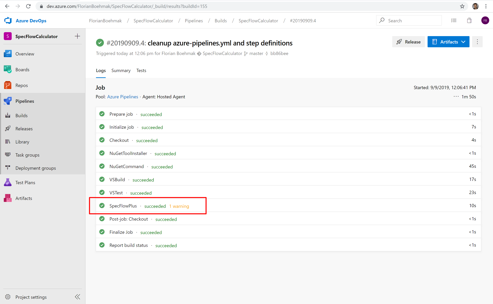
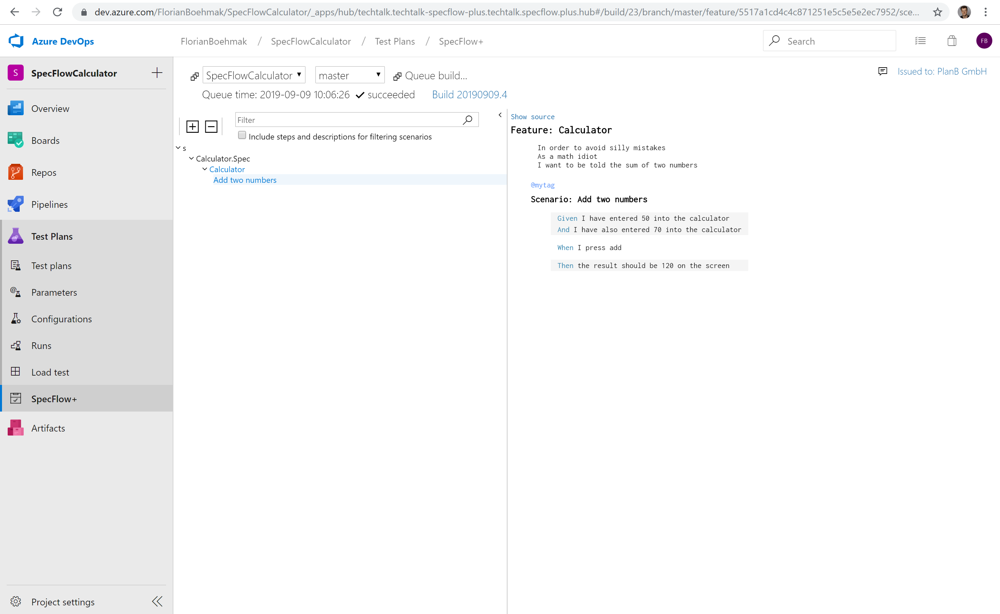
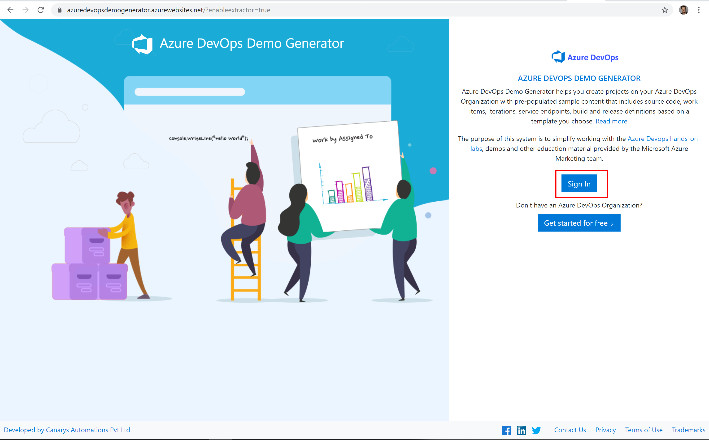
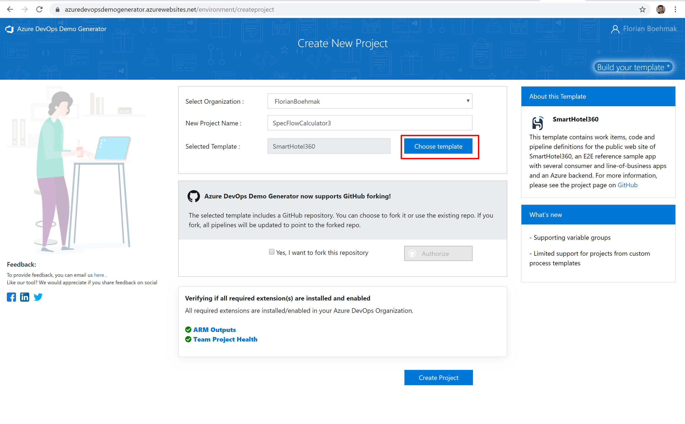
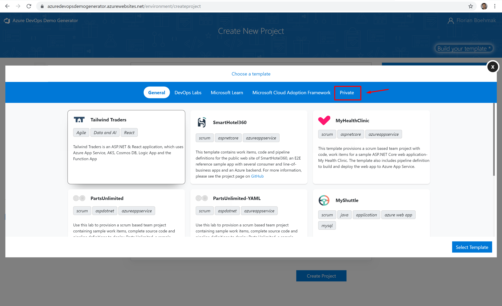

# SpecFlow+ up and running on AzureDevOps

# Setup

1. install DevOps extension: [SpecFlow+LivingDoc](https://marketplace.visualstudio.com/items?itemName=techtalk.techtalk-specflow-plus)

2. Provision this project using the Azure DevOps Generator:

3. https://azuredevopsdemogenerator.azurewebsites.net/?enableextractor=true

4. Select Choose Template

5. You will see a new tab labeled Private. Select the tab.

